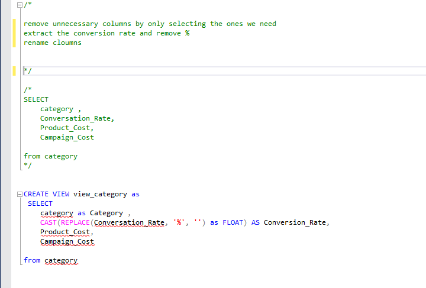

# TOP Youbue Channel 2025

# Objective
The Head of Marketing wants to find out who the top YouTubers are in 2025 to decide on which YouTubers would be best to run marketing campaigns throughout the rest of the year.
# •	What is the ideal solution?
To create a dashboard that provides insights into the top YouTubers in 2025 that includes their
•	subscriber count
•	total views
•	total videos
This will help the marketing team make informed decisions about which YouTubers to collaborate with for their marketing campaigns.
# Data source
 Two tables with data on the top YouTubers in 2025 that includes their
•	channel names
•	total subscribers
•	total views
•	total videos uploaded
Category table and their corresponding campaign cost details 
The data is sourced from Kaggle (an Excel extract)
# Stages
•	Design
•	Developement
•	Testing
•	Analysis
# Design
Dashboard components required
•	What should the dashboard contain based on the requirements provided?
To understand what it should contain, we need to figure out what questions we need the dashboard to answer:
1.	Who are the top 10 YouTubers with the most subscribers?
2.	Which 10 channels have uploaded the most videos and views
3.	Total subscribers by category
4.	Total views by category
5.	Which 5 channels have the highest subscriber engagement rate per video uploaded
For now, these are some of the questions we need to answer, this may change as we progress down our analysis.

# Development
Pseudocode
•	What's the general approach in creating this solution from start to finish?
1.	Get the data
2.	Explore the data in Excel
3.	Load the data into SQL Server
4.	Clean the data with SQL
5.	Test the data with SQL
6.	Visualize the data in Power BI
7.	Generate the findings based on the insights
8.	Write the documentation + commentary
9.	Publish the data to GitHub Pages
    
## Transform the data
# Create the SQL view

# Testing
•	What data quality and validation checks are you going to create?
Here are the data quality tests conducted:
1. Row count check
2. Column count check
3. Column datatype check
4. Duplicate value check

- Category Table
  

- Youtube channel Table

## Visualization
Results
•	What does the dashboard look like?

SQL Quert=y and result of top 10 profitable youtube channels and its details

# Discovery
•	What did we learn?
We discovered that
1.	T- series, Coco Melon and SET india are the channnels with the most subscribers 
2.	SET india, T- series and PewDiePie are the channels with the most videos uploaded
3.	T- series, Coco Melon and SET india are the channels with the most views
4.	Music and Entertainment channels are useful for broader reach, as the channels posting consistently on their platforms and generating the most engagement are focus on entertainment and music
Recommendations
•	What do you recommend based on the insights gathered?
1.	T-series is the best YouTube channel to collaborate with if we want to maximize visibility because this channel has the most YouTube subscribers in the UK
2.	Although Mr Beast, cocomelon are regular publishers on YouTube, it may be worth considering whether collaborating with them with the current budget caps are worth the effort.
3.	The most profitable categories to deal with would be Music, Entertainment and then People & Blogs. Michael Jackson will be the most profitable option followed by Maluma, Adele and Rihanna.
4.	The top 3 channels to form collaborations with are Inside Edition, Ryan’s World and Tsuriki Show based on this analysis, because they attract the most engagement on their channels consistently.

# Action plan
•	What course of action should we take and why?
Based on our analysis, we believe the best channel to advance a long-term partnership deal with to promote the client's products is the channels under music category like Michael Jackson, Adele etc
We'll have conversations with the marketing client to forecast what they also expect from this collaboration. Once we observe we're hitting the expected milestones, we'll advance with potential partnerships with DanTDM, Mister Max and NoCopyrightSounds channels in the future.
•	What steps do we take to implement the recommended decisions effectively?
1.	Reach out to the teams behind each of these channels, starting with Dan Rhodes
2.	Negotiate contracts within the budgets allocated to each marketing campaign
3.	Kick off the campaigns and track each of their performances against the KPIs
4.	Review how the campaigns have gone, gather insights and optimize based on feedback from converted customers and each channel's audiences

